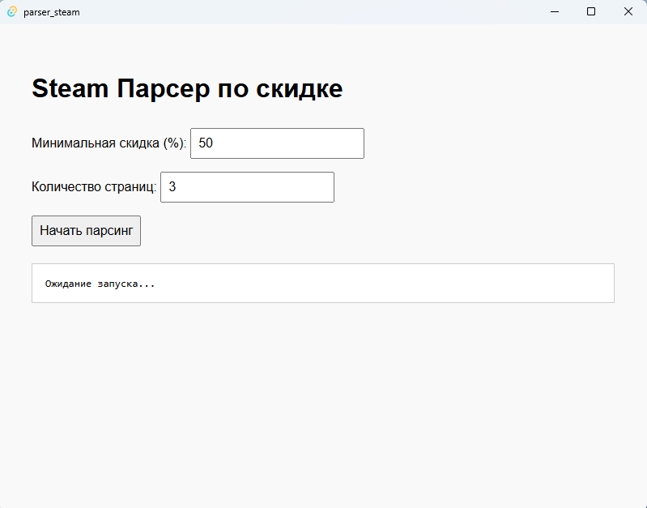

# 🎮 Steam Discount Parser


---

**Steam Discount Parser** — это кроссплатформенное настольное приложение, написанное на [Rust](https://www.rust-lang.org/) с использованием [Tauri](https://tauri.app/). Оно собирает информацию о текущих скидках на игры в Steam и отображает результаты в удобном интерфейсе.

> ✨ Это мой первый завершённый проект. Да, он ещё сырой, есть куда развиваться, но уже сейчас он выполняет свои основные задачи.  
> Я буду очень рад вашей поддержке, обратной связи или просто доброму слову. Спасибо! 💙

---

## 📸 Скриншоты



---

## ⚙️ Установка и запуск

### 🔧 Предварительные требования

Перед запуском убедитесь, что у вас установлены:

- [Rust](https://www.rust-lang.org/tools/install)
- [Node.js](https://nodejs.org/)
- [Tauri CLI](https://tauri.app/v1/guides/getting-started/prerequisites)

### 🚀 Сборка и запуск

```bash
# Клонировать репозиторий
git clone https://github.com/Soul32100l/parser_steam_rust.git
cd parser_steam_rust

# Запустить в режиме разработки
cargo tauri dev
```

---

## 📚 Технологии и библиотеки

Проект основан на современных инструментах и библиотеках:

| Технология | Назначение | Ссылка |
|------------|------------|--------|
| **[Tauri](https://tauri.app/)** | Фреймворк для создания лёгких десктопных приложений с использованием Rust и Web UI |
| **[Rust](https://www.rust-lang.org/)** | Язык программирования, на котором построена логика приложения |
| **[Reqwest](https://docs.rs/reqwest/)** | HTTP-клиент для получения данных со страницы Steam |
| **[Serde](https://serde.rs/)** | Сериализация и десериализация данных в JSON и других форматах |
| **[HTML/CSS/JS](https://developer.mozilla.org/)** | Интерфейс приложения — простой, чистый и нативный |
| **[Tauri Plugin SQL (опционально)](https://github.com/tauri-apps/plugins-workspace/tree/dev/plugins/sql)** | Для хранения данных локально (в будущих версиях) |

---

## 🗂 Структура проекта

```
parser_steam_rust/
├── ui/              # UI (HTML, CSS, JS)
├── src-tauri/        # Бэкенд на Rust
│   ├── tauri.conf.json
│   └── main.rs
├── Cargo.toml        # Основной файл зависимостей
└── README.md
```

---

## 📃 Лицензия

Проект распространяется под лицензией [MIT](LICENSE).

---

## 🙌 Благодарности

Спасибо каждому, кто заинтересовался проектом!  
Если вы нашли баг, есть идеи для улучшений — не стесняйтесь открыть [Issue](https://github.com/Soul32100l/parser_steam_rust/issues) или предложить PR.

---

## 💬 Связь

Хочешь пообщаться, предложить улучшения или просто поддержать?  
Пиши в Telegram: **[@SoulMan32100](https://t.me/SoulMan32100)**  
Группа в Telegrram: **[@soul_1457](https://t.me/soul_1457)**